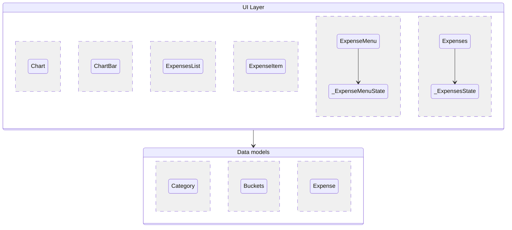
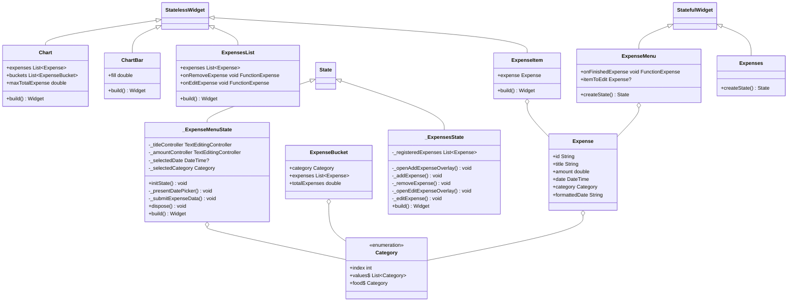

# expense_tracker_app

Flutter project for the first assignment in IDATA2503 Mobile Application 2023.

## Specifications

The list of Specifications is taken from the the current assignment found [here](https://docs.google.com/document/d/1NN_8vQoxLk_hnm8AVWTyfnkeDqMhBqonc5t1VH394lU/edit)

I believe the application is meeting every specification as of date 04.10.2023 within the specifications 1-13.

The points 14 and is further requirements given within the assignment for documentation which will be given in this file

## User Story

Since this application is mostly written using a tutorial given within a Udemy course, I would intemperate it as writing a user story for the feature specified in point 12. My reason being that this is the feature I have planned and implemented, and therefore have sufficient background info about the thinking method to argument for the method of implementation.

### As a person I want to be able to change my finances so I can edit it in case of mistyping or wrong categorizing

This can be done trough modifying the new_expense to [expenseMenu](./lib/widgets/expenseMenu.dart).
The changes includes allowing the menu to accept a expense so we know if we are modifying or it is a new one. The reason we are changing the class instead of implementing a new one, is because the widget already meets our requirements for attributes in the expense to be changed .

We also need to allow the user access to this feature so we are adding a functionality to list to allow users to tap it for editing it. This requires we modify both expenses, expensesList and expensesItem to pass down a openEditing function.

## File Structure

### [lib](./lib/)

The root folder of the code

- [main.dart](./lib/main.dart) The main application file

#### [models](./lib/models/)

This folder contains everything that has data models within it such as:

- [expense](./lib/models/expense.dart) that represents a expense in data form

#### [widgets](./lib/widgets/)

This folder contains everything that has widget (visualization of data) within it

- [expenseMenu.dart](./lib/widgets/expenseMenu.dart) used for showing a page to edit or adding new expense
- [expenses.dart](./lib/widgets/expenses.dart) used as a page to visualize information about the expenses
- [chart](./lib/widgets/chart/) containing everything to visualize the expenses as a data chart.
  - [chart.dart](./lib/widgets/chart/chart.dart) visualizes the chart
  - [chart_bar.dart](./lib/widgets/chart/chart_bar.dart) visualizes a bar within the chart. One bar represents one category.
- [expenses_list](./lib/widgets/expenses_list/) Containing everything needed to visualizing a list of expenses
  - [expense_item.dart](./lib/widgets/expenses_list/expense_item.dart) Each individual item within the list
  - [expense_list.dart](./lib/widgets/expenses_list/expenses_list.dart) is a parent widget to contain every expense_item in a orderly fashion

## App architecture Diagram

## Class Diagram

Auto generated trough the package flutters dcdg package:

